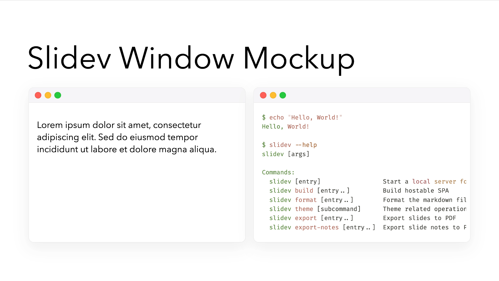

# Slidev Addon: Window Mockup

A Slidev addon that provides a window mockup component to display content in a styled window frame.

[](https://www.npmjs.com/package/slidev-addon-window-mockup)

[](https://whitphx.github.io/slidev-addon-window-mockup/)

[👉 Check out the demo and docs](https://whitphx.github.io/slidev-addon-window-mockup/).

## Installation

```bash
npm install slidev-addon-window-mockup
```

## Slidev configuration

```yml
---
addons:
  - window-mockup
---
```

## Usage

### Basic Usage

Wrap any content in a `<WindowMockup>` component:

```html
<WindowMockup>
  Lorem ipsum dolor sit amet, consectetur adipiscing elit. Sed do eiusmod tempor
  incididunt ut labore et dolore magna aliqua.
</WindowMockup>
```

### Color Themes

Choose between light and dark themes:

```html
<!-- Using color prop -->
<WindowMockup color="light"> Content here </WindowMockup>

<WindowMockup color="dark"> Content here </WindowMockup>

<!-- Using shorthand attributes -->
<WindowMockup light> Content here </WindowMockup>

<WindowMockup dark> Content here </WindowMockup>
```

### Code Block Integration

#### Component Syntax

Use the `codeblock` prop to wrap code blocks:

````html
<WindowMockup codeblock>
  ```shell $ echo "Hello, World!" Hello, World! ```
</WindowMockup>
````

#### Markdown Syntax

This addon enables special syntax for code blocks.
Use the `window` keyword after the language in code fences:

````markdown
```shell window
$ echo "Hello, World!"
Hello, World!
```
````

## More usage

[👉 Check out the demo and docs](https://whitphx.github.io/slidev-addon-window-mockup/).
